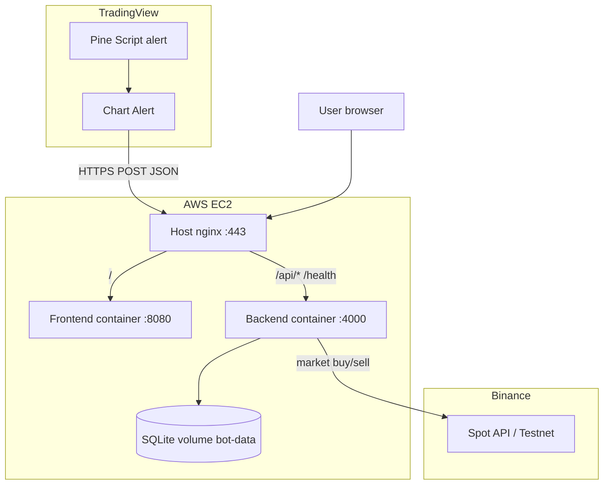
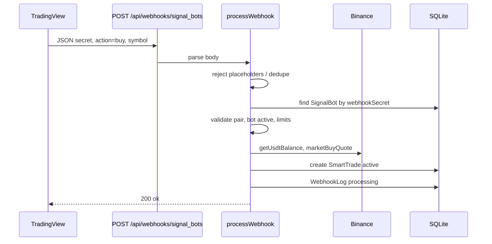

# Signal Bot — Complete Technical Guide

> **Audience:** AI agents and engineers onboarding to this codebase.  
> **Repository:** https://github.com/MuhammadMuhamid/3commabotclone (private)  
> **Local checkout:** wherever this repository is cloned.  
> **Last audited:** 2026-08-24

---

## Table of contents

1. [Executive summary](#1-executive-summary)
2. [Why this bot exists](#2-why-this-bot-exists)
3. [System architecture](#3-system-architecture)
4. [Tech stack](#4-tech-stack)
5. [Directory tree](#5-directory-tree)
6. [Backend deep dive](#6-backend-deep-dive)
7. [Frontend deep dive](#7-frontend-deep-dive)
8. [TradingView integration](#8-tradingview-integration)
9. [Deployment](#9-deployment)
10. [Configuration reference](#10-configuration-reference)
11. [Operational guide](#11-operational-guide)
12. [Glossary](#12-glossary)
13. [Known gaps and TODOs](#13-known-gaps-and-todos)

---

## 1. Executive summary

**Signal Bot** is a self-hosted, 3Commas-style **signal trading bot** that:

- Receives **TradingView webhook alerts** (JSON over HTTPS)
- Validates per-bot secrets, deduplicates noisy TV alerts
- Executes **Binance Spot** market buy/sell orders
- Tracks open positions as **SmartTrades** with live PnL, take-profit, and stop-loss
- Provides a **React dashboard** to configure bots, exchange accounts, and view trade history

| Item | Value |
|------|--------|
| **Production URL** | `https://bot.alphawebstudioz.com` |
| **Webhook endpoint** | `POST https://bot.alphawebstudioz.com/api/webhooks/signal_bots` |
| **Health check** | `GET /health` → `{ status: "ok", dryRun: boolean }` |
| **Backend** | Node 22, Express 4, TypeScript, Prisma 6, SQLite |
| **Frontend** | React 19, Vite 6, Tailwind 4, React Router 7 |
| **Exchange** | Binance Spot via `binance-api-node` 0.12.9, pinned (testnet supported) |
| **Deploy** | Docker Compose on AWS EC2 (ap-southeast-2), host nginx + Let's Encrypt |

**Risk:** Live trading can lose money. Default local dev uses `DRY_RUN=true` (simulated fills at ticker price, no real orders).

---

## 2. Why this bot exists

### Problem

Automated trading from **TradingView** strategies typically requires a middle layer:

| Approach | Limitation |
|----------|------------|
| **3Commas / similar SaaS** | Subscription cost, vendor lock-in, shared infrastructure |
| **TradingView broker integration** | Limited brokers, not always Binance spot with custom sizing |
| **Manual trading** | Cannot react to alerts in seconds |

### Solution

This project is a **custom webhook executor** that:

1. Mirrors a **3Commas Signal Bot** workflow (dashboard, SmartTrades, multi-pair bots)
2. Uses a **stable webhook path** compatible with TV alert setup: `/api/webhooks/signal_bots`
3. Stores **encrypted Binance API keys** per exchange account in SQLite
4. Assigns each bot a unique **`webhookSecret`** so one server can run many bots safely
5. Integrates with **SR+Trend v5** Pine strategy via `alert()` JSON (see `deploy/`)

### vs 3Commas

| Feature | This bot | 3Commas (reference) |
|---------|----------|---------------------|
| Webhook URL pattern | `/api/webhooks/signal_bots` | Similar signal-bot path |
| Per-bot secret | `webhookSecret` in JSON | Bot token in payload |
| SmartTrade tracking | `SmartTrade` model + dashboard | SmartTrade UI |
| Exchange | Binance Spot (extensible schema) | Many exchanges |
| TP/SL | Server-side poll every 30s | Platform-managed |
| Short / futures | UI only; spot long focus | Full product |

---

## 3. System architecture

### 3.1 High-level diagram



### 3.2 Buy signal flow



### 3.3 Sell / exit flow

1. **Webhook sell** — Pine `longJustClosed` or manual `action: sell` → `marketSellBase` → close latest active `SmartTrade` for bot+pair (`closedReason: signal_exit`).
2. **Dashboard close** — `POST /api/trades/:id/close` → internal `processWebhook` with `SELL` + stored quantity.
3. **Take profit / stop loss** — `setInterval` 30s → `checkTakeProfitStopLoss` → compares `pnlPct` to bot thresholds → `marketSellBase` → `closedReason: take_profit` or `stop_loss`.

### 3.4 Process layout (production)

| Port | Service |
|------|---------|
| 443 | Host nginx (TLS, routes to 4000 and 8080) |
| 8080 | Frontend Docker (nginx serving static React) |
| 4000 | Backend Docker (Express API) |

Local dev: frontend `5173` proxies `/api` and `/health` to backend `4000`.

---

## 4. Tech stack

| Layer | Technology |
|-------|------------|
| Runtime | Node.js 22 (Alpine in Docker) |
| API | Express 4, `cors`, `zod` validation |
| ORM | Prisma 6 → SQLite |
| Exchange SDK | `binance-api-node` **0.12.9, pinned exactly** — see *Money and the exchange SDK* below |
| Crypto | Node `crypto` AES-256-GCM for API secrets |
| Frontend | React 19, Vite 6, Tailwind CSS 4 |
| Routing | `react-router-dom` 7 |
| Containers | Docker Compose v2 (`docker.io` + `docker-compose-v2` on EC2) |
| Reverse proxy | nginx (host + frontend container) |
| TLS | certbot / Let's Encrypt |
| Cloud | AWS EC2 `t3.micro`, Ubuntu 22.04, Elastic IP, ap-southeast-2 |

---

## 5. Directory tree

```
tradingbot/
├── README.md                          # Quick start, env table, risk notice
├── docker-compose.yml                 # backend:4000 + frontend:80 (8080 on EC2)
│
├── backend/
│   ├── Dockerfile                     # build TS, prisma migrate deploy, node dist
│   ├── package.json                   # signal-bot-backend
│   ├── tsconfig.json
│   ├── .env.example                   # local env template
│   ├── prisma/
│   │   ├── schema.prisma              # ExchangeAccount, SignalBot, SmartTrade, WebhookLog
│   │   └── migrations/
│   │       ├── 20260519000000_init/
│   │       └── 20260519120000_max_smart_trades/
│   └── src/
│       ├── index.ts                   # Express app, routes mount, TP/SL interval
│       ├── config.ts                  # env → config object
│       ├── routes/
│       │   ├── bots.ts                # CRUD + stats + webhook JSON helpers
│       │   ├── webhooks.ts            # POST signal_bots
│       │   ├── trades.ts              # list trades, manual close
│       │   └── exchange.ts            # Binance account CRUD + balance
│       ├── services/
│       │   ├── webhook.ts             # processWebhook — core trading logic
│       │   ├── binance.ts             # client, balances, market orders, dry run
│       │   └── smartTrade.ts          # PnL refresh, TP/SL monitor
│       └── lib/
│           ├── prisma.ts              # PrismaClient singleton
│           ├── crypto.ts              # encrypt/decrypt API keys
│           ├── symbols.ts             # normalizeSymbol, parsePair
│           └── investment.ts          # sizing units, calcOrderQuoteUsdt
│
├── frontend/
│   ├── Dockerfile                     # vite build → nginx alpine
│   ├── nginx.conf                     # SPA + proxy /api to backend:4000
│   ├── vite.config.ts                 # dev proxy to :4000
│   ├── package.json
│   └── src/
│       ├── main.tsx                   # React root + BrowserRouter
│       ├── App.tsx                    # nav + routes
│       ├── index.css                  # CSS variables (dark theme)
│       ├── api.ts                     # fetch wrapper + types + api object
│       ├── components/
│       │   ├── ui.tsx                 # Btn, Toggle, Section, Input, CopyField, LongBadge
│       │   └── BotFormFields.tsx      # shared create/edit form
│       └── pages/
│           ├── Dashboard.tsx          # bots table, stats, SmartTrades
│           ├── CreateBot.tsx
│           ├── EditBot.tsx
│           └── Settings.tsx           # Binance API keys
│
└── deploy/
    ├── remote-deploy.sh               # rsync from Mac → EC2, env, nginx, certbot
    ├── setup-server.sh                # apt docker, compose up, health curls
    ├── finish-on-server.sh            # on-server rebuild + nginx reload
    ├── EC2-SETUP.md                   # launch instance, Elastic IP, DNS
    ├── AWS.md                         # generic deploy steps
    ├── nginx-production.conf          # host SSL → :4000 api, :8080 UI
    ├── nginx-signalbot.conf           # alternate nginx snippets
    ├── nginx-host-ssl.conf
    ├── TRADINGVIEW-ALERT-FIX-DOUBLE.md
    ├── SR-Trend-v5-PINE-PATCH.md
    ├── SR-Trend-v5-custom-webhook-ALERTS.pine
    ├── pine-exit-webhook.snippet.pine  # deprecated pointer
    └── cloudshell-launch.sh
```

**Intentionally excluded from documentation depth:** `node_modules/`, `backend/dist/`, `frontend/dist/`, lockfiles.

---

## 6. Backend deep dive

### 6.1 Entry point — `backend/src/index.ts`

| Responsibility | Detail |
|----------------|--------|
| `assertEncryptionKey()` | Warns if `ENCRYPTION_KEY` &lt; 32 chars |
| Middleware | `cors()`, `express.json({ limit: "1mb" })` |
| Routes | See [§6.4](#64-api-routes-reference) |
| Background job | `setInterval(checkTakeProfitStopLoss, 30_000)` |
| Listen | `config.port` (default 4000) |

### 6.2 Configuration — `backend/src/config.ts`

Exports `config` from environment:

| Field | Env var | Default |
|-------|---------|---------|
| `port` | `PORT` | `4000` |
| `publicUrl` | `PUBLIC_URL` | `http://localhost:4000` (trailing slash stripped) |
| `dryRun` | `DRY_RUN` | `true` |
| `encryptionKey` | `ENCRYPTION_KEY` | `""` |
| `binanceApiKey` | `BINANCE_API_KEY` | `""` |
| `binanceApiSecret` | `BINANCE_API_SECRET` | `""` |
| `binanceTestnet` | `BINANCE_TESTNET` | `false` |

`assertEncryptionKey()` logs a warning only; does not exit.

### 6.3 Prisma models

#### `ExchangeAccount`

| Field | Type | Purpose |
|-------|------|---------|
| `id` | UUID | Primary key |
| `name` | String | Display name ("My Binance") |
| `exchange` | String | Default `"binance"` |
| `marketType` | String | Default `"spot"` |
| `apiKeyEnc` | String | AES-256-GCM encrypted API key |
| `apiSecretEnc` | String | Encrypted secret |
| `testnet` | Boolean | Use `https://testnet.binance.vision` |
| `bots` | Relation | SignalBots using this account |

#### `SignalBot`

| Field | Type | Purpose |
|-------|------|---------|
| `id` | UUID | Primary key |
| `name` | String | Bot display name |
| `alertType` | String | `"custom"` \| `"tradingview"` (informational) |
| `direction` | String | `"long"` \| `"short"` \| `"reversal"` (stored; spot logic is long-focused) |
| `pairs` | String | JSON array of symbols, e.g. `["NEARUSDT","TIAUSDT"]` |
| `maxInvestmentPct` | Float | Amount for sizing (meaning depends on unit) |
| `maxInvestmentUnit` | String | `pct_bot`, `pct_trade`, `usdt_bot`, `usdt_trade` |
| `status` | String | `"active"` \| `"paused"` |
| `webhookSecret` | String | Unique secret for webhook auth |
| `entryEnabled` | Boolean | If false, buy webhooks rejected |
| `entryVolumePct` | Float | % of computed quote to use per entry (default 100) |
| `entryOrderType` | String | `"market"` \| `"limit"` — **only market implemented** |
| `exitEnabled` | Boolean | Stored in DB — **not enforced in webhook sell path** |
| `takeProfitEnabled` | Boolean | Enable TP monitor |
| `takeProfitPct` | Float? | Close when `pnlPct >=` this |
| `stopLossEnabled` | Boolean | Enable SL monitor |
| `stopLossPct` | Float? | Close when `pnlPct <= -abs(this)` |
| `maxEntryOrders` | Int? | Max concurrent active trades **per pair** |
| `maxActiveSmartTradesEnabled` | Boolean | Cap total active trades for bot |
| `maxActiveSmartTrades` | Int? | Max concurrent active SmartTrades (default 2 when enabled) |
| `exchangeAccountId` | String? | FK to ExchangeAccount; null → env Binance keys |

#### `SmartTrade`

| Field | Type | Purpose |
|-------|------|---------|
| `id` | UUID | Primary key |
| `botId` | String | FK SignalBot |
| `pair` | String | Normalized symbol e.g. `NEARUSDT` |
| `direction` | String | `"long"` or `"short"` from bot |
| `status` | String | `"active"` \| `"closed"` |
| `entryPrice` | Float? | Fill average on buy |
| `currentPrice` | Float? | Last ticker for PnL |
| `quantity` | Float | Base asset qty held |
| `quoteSpent` | Float | USDT spent on buy |
| `pnlUsdt` | Float | Unrealized/realized PnL in USDT |
| `pnlPct` | Float | PnL % vs quoteSpent |
| `buyPrice` | Float? | Same as entry for buys |
| `exchangeOrderId` | String? | Binance order id or `dry-*` |
| `closedReason` | String? | `signal_exit`, `take_profit`, `stop_loss` |
| `closedAt` | DateTime? | When closed |

#### `WebhookLog`

| Field | Type | Purpose |
|-------|------|---------|
| `id` | UUID | Primary key |
| `botId` | String? | FK (nullable on delete) |
| `payload` | String | Raw JSON string |
| `status` | String | `processing`, `error` (success not written back) |
| `message` | String? | Error text on failure |

### 6.4 API routes reference

#### Root (`index.ts`)

| Method | Path | Behavior |
|--------|------|----------|
| GET | `/health` | `{ status: "ok" }` — public; deliberately exposes no internal state |
| GET | `/api/config` | `{ publicUrl, webhookPath, dryRun }` — **requires auth** |

#### `authRouter` — prefix `/api/auth`

All dashboard routes are gated behind `requireAuth`. Login is two-step: password, then TOTP.

| Method | Path | Auth | Behavior |
|--------|------|------|----------|
| GET | `/status` | none | `{ setup: true }` once an admin account exists |
| POST | `/register` | none | Creates the one-and-only admin. 409 once a user exists |
| POST | `/login` | none | Verifies password → `{ step, setupToken }`. Grants **no** API access |
| POST | `/totp/qr` | setupToken | Generates TOTP secret, stores encrypted, returns QR + manual key |
| POST | `/totp/enable` | setupToken | First-run: verifies code, activates MFA, issues session cookies |
| POST | `/totp/verify` | setupToken | Subsequent logins: verifies code, issues session cookies |
| POST | `/refresh` | refresh cookie | Rotates refresh token, issues a new 15-min access token |
| POST | `/logout` | refresh cookie | Revokes the refresh token and clears both cookies |
| GET | `/me` | access cookie | `{ username, totpEnabled }` |

#### `notificationsRouter` — prefix `/api/notifications`

| Method | Path | Behavior |
|--------|------|----------|
| GET | `/status` | `{ enabled, subscribed, subscriptions, publicKey }` |
| POST | `/subscribe` | Registers a Web Push subscription |
| DELETE | `/subscribe` | Removes a subscription by endpoint |

#### `exchangeRouter` — prefix `/api/exchange-accounts`

| Method | Path | Handler | Behavior |
|--------|------|---------|----------|
| GET | `/` | list | All accounts (no secrets) |
| POST | `/` | create | Zod: name, apiKey, apiSecret, testnet? → encrypt → create |
| GET | `/:id/balance` | balance | `getUsdtBalance` via Binance |
| DELETE | `/:id` | remove | Hard delete account |

#### `botsRouter` — prefix `/api/bots`

| Method | Path | Behavior |
|--------|------|----------|
| GET | `/` | List bots with stats: totalProfit, activeSmartTrades, signalCount, tradingSince, webhookUrl, entry/exit JSON templates |
| GET | `/stats` | Global: upnl, locked, activeCount, closedCount, todayPnl, botCount, activeBotCount, stoppedBotCount |
| GET | `/meta/units` | Returns `INVESTMENT_UNITS` labels |
| GET | `/:id` | Single bot via `mapBot()` |
| POST | `/` | Create bot; generates 48-char hex `webhookSecret` |
| PATCH | `/:id` | Partial update via `botSchema.partial()` |
| DELETE | `/:id` | Delete bot (cascades SmartTrades) |
| POST | `/:id/toggle` | Toggle `active` ↔ `paused` |

**Helper functions in `bots.ts`:**

| Function | Purpose |
|----------|---------|
| `webhookUrl()` | `{publicUrl}/api/webhooks/signal_bots` |
| `entryJson(secret)` | Template for TV entry with `{{strategy.order.action}}`, `{{ticker}}`, `{{timenow}}` |
| `exitJson(secret)` | Static sell template |
| `tradingViewSetup()` | Instructions object for UI |
| `mapBot(b, extra?)` | Parses `pairs` JSON, adds labels and webhook helpers |

#### `tradesRouter` — prefix `/api/trades`

| Method | Path | Behavior |
|--------|------|----------|
| GET | `/` | Query `status` (`active` \| `history`→`closed`), optional `botId`; calls `refreshAllActivePnL()` first |
| POST | `/:id/close` | Loads trade; `processWebhook({ secret, action: "SELL", symbol, quantity })` |
| POST | `/:id/partial-close` | Sells a percentage of an active trade; records a `PartialClose` row |
| DELETE | `/:id` | Removes a trade record (history cleanup; does not touch the exchange) |

#### `webhooksRouter` — prefix `/api/webhooks`

| Method | Path | Behavior |
|--------|------|----------|
| POST | `/signal_bots` | `processWebhook(req.body)`; maps errors to 401/403/503/400 |

### 6.5 Services

#### `processWebhook(body)` — `services/webhook.ts`

**Exported type `WebhookBody`:**

```ts
{
  secret?: string;
  action?: string;
  symbol?: string;
  tv_instrument?: string;
  quote_order_qty?: number;
  quantity?: number;
  dedupe_key?: string;
}
```

**Processing pipeline:**

1. **`isPlaceholderPayload`** — Rejects if body contains `{{alert_message}}`, `{{strategy.order`, missing secret, or `REPLACE_ME` → 401-style error message.
2. **Lookup bot** by `webhookSecret`; must be `status === "active"`.
3. **`resolveSymbol`** — `normalizeSymbol(symbol ?? tv_instrument)`.
4. **Pair allowlist** — symbol must be in bot's `pairs` JSON array.
5. **Caller dedupe `dedupe_key`** — durable hashed `WebhookReceipt`, TTL 120s. Entry scale-ins without a caller identity are deliberately not collapsed.
6. **Exit dedupe** — durable key `trade:{bot}:{symbol}:sell:{leg}`, TTL 45s. A known pre-submit failure/rejection releases its receipt; an uncertain submission retains it.
7. **Log** `WebhookLog` with `status: "processing"` and run the global halt/risk preflight before exchange access.
8. **Buy branch** (`resolveAction` → buy):
   - Requires `entryEnabled`
   - `assertCanOpenTrade` (max active SmartTrades, max per-pair entry orders)
   - `getClient(bot)` → account or env
   - `calcOrderQuoteUsdt(bot, usdtBalance, quote_order_qty)`
   - `marketBuyQuote` → create `SmartTrade` active → `updateSmartTradePnl`
   - an ambiguous submission exception queries the deterministic client order ID and accepts only authoritative `FILLED` exchange truth
9. **Sell branch**:
   - Resolve quantity from body, else latest active SmartTrade, else wallet free base
   - Cap qty to `getBaseFreeBalance`
   - `marketSellBase` → update SmartTrade closed with PnL

**`resolveAction(action)` aliases:**

| Resolves to `buy` | Resolves to `sell` |
|-------------------|-------------------|
| buy, enterlong, long, entrylong, openlong | sell, exitlong, closelong, close, exit, closeposition, market |

**Durable dedupe:** `WebhookReceipt` hashes identities in SQLite, so replay
protection survives restarts and workers. This does not replace exchange
reconciliation: ambiguous submissions retain their receipt, and a hard crash
before a strategy `SmartTrade` write still needs operator exchange-to-ledger
recovery.

#### `services/binance.ts`

| Export | Purpose |
|--------|---------|
| `clientFromAccount(account)` | Decrypt keys; testnet base URL if flagged |
| `clientFromEnv()` | Global keys from config; null if missing |
| `getUsdtBalance(client)` | Free USDT from `accountInfo` |
| `getTickerPrice(client, symbol)` | `prices({ symbol })` |
| `marketBuyQuote(client, symbol, quoteUsdt)` | MARKET BUY with `quoteOrderQty`; dry-run simulates |
| `marketSellBase(client, symbol, quantity)` | Uses `resolveSellQuantity` (LOT_SIZE step, min qty) |
| `resolveSellQuantity(client, symbol, requestedQty)` | Floor to step, enforce min |
| `getBaseFreeBalance(client, symbol)` | Free base asset balance |

**Dry run:** When `config.dryRun`, orders return fake `orderId: dry-{timestamp}` at current ticker price.

#### `services/smartTrade.ts`

| Export | Purpose |
|--------|---------|
| `updateSmartTradePnl(tradeId, client?)` | Ticker price → update currentPrice, pnlUsdt, pnlPct |
| `refreshAllActivePnL()` | Loop all active trades |
| `checkTakeProfitStopLoss()` | Every 30s from index.ts; sells on TP/SL hit |

### 6.6 Libraries

#### `lib/crypto.ts`

- **Algorithm:** AES-256-GCM
- **Key derivation:** `sha256(ENCRYPTION_KEY || "dev-insecure-key")`
- **Blob format:** base64(`iv(12) + tag(16) + ciphertext`)
- **`decrypt` failure:** Throws user-facing message about re-adding keys after redeploy

#### `lib/symbols.ts`

| Function | Behavior |
|----------|----------|
| `normalizeSymbol(raw)` | Uppercase; strip `EXCHANGE:` prefix; remove `/` `-` |
| `parsePair(symbol)` | Split into base/quote using USDT, USDC, BUSD, BTC, ETH suffixes |
| `toBinanceSymbol(symbol)` | Alias for normalize |

#### `lib/investment.ts`

| Export | Purpose |
|--------|---------|
| `INVESTMENT_UNITS` | Human labels for 4 unit types |
| `normalizeInvestmentUnit(unit)` | Maps legacy strings to enum keys |
| `formatInvestmentLabel(amount, unit)` | e.g. `100%` or `50 USDT` |
| `calcOrderQuoteUsdt(bot, usdtBalance, webhookQuote?)` | If `webhookQuote` set, use it; else compute from unit × `entryVolumePct` |

**Sizing logic:**

| Unit | Base amount before entryVolumePct |
|------|-----------------------------------|
| `pct_bot`, `pct_trade` | `(usdtBalance × maxInvestmentPct) / 100` |
| `usdt_bot`, `usdt_trade` | `maxInvestmentPct` as fixed USDT |

> **Note:** `pct_trade` and `usdt_trade` do **not** divide balance by number of active trades; behavior matches per-bot percentage in practice.

#### `lib/prisma.ts`

Single `PrismaClient` export.

---

## 6.7 Authentication and sessions

Single-admin design: one account, password + mandatory TOTP. There is no signup
flow beyond the first registration, and `/register` returns 409 forever after.

### Token model

| Token | Lifetime | Transport | Purpose |
|-------|----------|-----------|---------|
| `setupToken` | 10 min | JSON response body | Bridges the password step to the TOTP step. Grants no API access |
| `access_token` | 15 min | httpOnly cookie, path `/` | Authorises every dashboard request |
| `refresh_token` | 30 days | httpOnly cookie, path `/api/auth/refresh` | Mints new access tokens. Rotated on every use |

Both cookies are `httpOnly` + `sameSite: strict`, and `secure` unless
`SECURE_COOKIES=false`. The refresh cookie is scoped to the refresh endpoint, so
the browser never sends it with ordinary API calls. Refresh tokens are stored as
SHA-256 hashes; the raw value exists only in the cookie.

### Refresh rotation and the concurrency hazard

Rotation is single-use: presenting a refresh token deletes it and issues a
replacement. That is the right security property, but it collides with a
dashboard that fires **five parallel requests every 15 seconds**
(`Promise.all` in `Dashboard.tsx`). When the access token expires, all five 401
at once and each would independently try to rotate the *same* refresh cookie —
the browser has not yet received the replacement.

This produced a hard failure in production (fixed 2026-08-24):

- One request won the race and rotated the token.
- The losers called `prisma.refreshToken.delete()` on the now-missing row, which
  threw **Prisma P2025** as an *unhandled rejection* — killing the Node process.
  The container had accumulated `RestartCount=13`.
- Each crash logged the user out and took the TP/SL monitor down with it.

Three defences now stand, and all three are load-bearing:

1. **Single-flight refresh** (`frontend/src/api.ts`) — concurrent 401s share one
   in-flight refresh promise, so only one rotation happens per expiry.
2. **Grace window** (`backend/src/routes/auth.ts`) — a rotated token is
   remembered for 60s; a late duplicate is replayed the replacement rather than
   having its session destroyed. In-memory, so it resets on restart, which is
   acceptable for a 60s window.
3. **`deleteMany` instead of `delete`** — returns `count: 0` rather than throwing
   when a concurrent request already removed the row. This is the guard that
   prevents the process from dying.

A process-level `unhandledRejection` / `uncaughtException` handler in `index.ts`
logs and keeps serving instead of exiting. For a daemon holding real positions,
staying up beats crashing mid-trade — but it means **the logs are now the failure
signal**, not the restart count. Grep for `stayed up` when auditing.

### Rate limiting

`/api/auth/refresh` has its own limiter (120 per 15 min), separate from the
credential limiter (20 per 15 min) that guards login/register/TOTP. A long-lived
session legitimately refreshes on a schedule; sharing the brute-force budget
locked users out mid-session.

---

## 7. Frontend deep dive

### 7.1 Routes (`App.tsx`)

| Path | Component | Purpose |
|------|-----------|---------|
| `/` | `Dashboard` | Bot list, metrics, SmartTrades tables |
| `/create` | `CreateBot` | New bot form + webhook copy screen |
| `/edit/:id` | `EditBot` | Load bot, edit, save |
| `/settings` | `Settings` | Add/remove Binance accounts |

Nav links: Dashboard, Create Bot, Settings.

### 7.2 API client (`api.ts`)

- **Base URL:** `""` (same origin; dev proxy via Vite)
- **`request<T>(path, init?)`** — JSON fetch; throws `Error` with `err.error` from body

**Exported `api` object:**

| Namespace | Methods |
|-----------|---------|
| `config()` | GET `/api/config` |
| `stats()` | GET `/api/bots/stats` |
| `bots.list/get/create/update/remove/toggle` | CRUD |
| `trades.list(status, botId?)` | GET `/api/trades` |
| `trades.close(id)` | POST close |
| `exchange.list/create/balance/remove` | Exchange accounts |

**Utilities:** `formatPair`, `copyText`, `INVESTMENT_UNIT_LABELS`, TypeScript types mirroring API.

### 7.3 Pages

#### `Dashboard.tsx`

- Polls every **15s**: bots, stats, trades (active/history tab), config (dry run badge)
- **Bot filters:** all / active / stopped
- **Metrics:** UPNL, Active SmartTrades, Bots count, Value Locked
- **BotRow:** edit, toggle start/stop, delete with confirm
- **TradeRow:** PnL bar for active; manual Close → `api.trades.close`

#### `CreateBot.tsx`

- Form → `api.bots.create(buildBotPayload(form))`
- Success view: copy webhook URL + entry JSON
- Validates at least one pair

#### `EditBot.tsx`

- Loads bot via `api.bots.get(id)` → `botToForm`
- PATCH on save; shows webhook copy screen (unchanged secret)

#### `Settings.tsx`

- Form: name, apiKey, apiSecret, testnet checkbox
- Lists connected accounts with remove

### 7.4 `BotFormFields.tsx`

| Section | Fields |
|---------|--------|
| Main | alertType cards, name, exchange select + balance, direction, pairs (preset + custom), max investment + unit, max active SmartTrades |
| Order settings | entry on/off, volume %, order type market/limit, exit toggle, TP/SL % |

**`buildBotPayload`:** nulls `takeProfitPct`/`stopLossPct` when disabled; nulls `maxActiveSmartTrades` when cap disabled.

**Preset pairs:** BTC, ETH, APT, NEAR, TIA, SOL, BNB, XRP, ADA, DOGE, AVAX, LINK USDT.

### 7.5 UI components (`components/ui.tsx`)

| Component | Role |
|-----------|------|
| `Btn` | Primary/secondary button |
| `Toggle` | Switch control |
| `Section` | Two-column section layout |
| `Input` | Labeled text/number input |
| `CopyField` | Read-only + copy button |
| `LongBadge` | Green "LONG" pill |

### 7.6 Styling

`index.css` defines CSS variables: `--color-bg`, `--color-panel`, `--color-accent`, `--color-success`, `--color-danger`, etc. Dark dashboard aesthetic modeled after 3Commas.

### 7.7 Docker frontend (`frontend/nginx.conf`)

- Serves SPA with `try_files` → `index.html`
- Proxies `/api/` and `/health` to `http://backend:4000`

---

## 8. TradingView integration

### 8.1 Webhook URL

```
https://bot.alphawebstudioz.com/api/webhooks/signal_bots
```

(Local: `http://localhost:4000/api/webhooks/signal_bots` or via Vite proxy.)

### 8.2 JSON payload format

**Minimum buy:**

```json
{
  "secret": "<webhookSecret from bot>",
  "action": "buy",
  "symbol": "NEARUSDT",
  "quote_order_qty": 100.01,
  "dedupe_key": "L-123-4567890"
}
```

**Buy using bot sizing (omit quote):**

```json
{
  "secret": "<webhookSecret>",
  "action": "BUY",
  "symbol": "APTUSDT",
  "dedupe_key": "{{timenow}}"
}
```

**Sell / exit:**

```json
{
  "secret": "<webhookSecret>",
  "action": "sell",
  "symbol": "NEARUSDT",
  "dedupe_key": "X-123-4567890"
}
```

**Optional fields:**

| Field | Purpose |
|-------|---------|
| `tv_instrument` | Alternative to `symbol` |
| `quantity` | Sell specific base qty; else uses active SmartTrade or wallet |
| `quote_order_qty` | Override USDT spend on buy |

**Response:**

| status | Meaning |
|--------|---------|
| `ok` | Order executed (or dry-run simulated) |
| `ignored_duplicate` | Dedupe blocked (still HTTP 200) |

### 8.3 TradingView alert settings (critical)

| Setting | Required value |
|---------|----------------|
| Condition | Strategy → **alert() function calls** ONLY |
| **NOT** | "Order fills and alert() function calls" (causes duplicates + 401) |
| Webhook URL | Production URL above |
| Message | `{{alert_message}}` |

See `deploy/TRADINGVIEW-ALERT-FIX-DOUBLE.md`.

### 8.4 Pine Script — `deploy/SR-Trend-v5-custom-webhook-ALERTS.pine`

Replaces bottom "Alerts" section of SR+Trend v5:

| Trigger | JSON action |
|---------|-------------|
| `longSignal` | `buy` + quote + dedupe_key `L-{bar}-{time}` |
| `shortSignal` (if enabled) | `sell` with quantity (short entry) |
| `longJustClosed` | `sell` exit dedupe_key `X-{bar}-{time}` |

**Inputs on chart:**

- Signal delivery = Custom webhook bot
- `ALERT_SECRET` = full bot secret (32+ chars)
- `alert_symbol` = per-chart pair (NEARUSDT, TIAUSDT, …)
- `alert_buy_usdt` = optional fixed quote

**Guard:** Runtime error if secret is `REPLACE_ME` or &lt; 32 chars.

### 8.5 UI-generated templates (`bots.ts`)

**Entry template** (for strategy order action substitution):

```json
{
  "secret": "<bot-secret>",
  "action": "{{strategy.order.action}}",
  "symbol": "{{ticker}}",
  "quote_order_qty": null,
  "dedupe_key": "{{timenow}}"
}
```

**Exit template:**

```json
{
  "secret": "<bot-secret>",
  "action": "sell",
  "symbol": "{{ticker}}",
  "dedupe_key": "{{timenow}}"
}
```

---

## 9. Deployment

### 9.1 Docker Compose (`docker-compose.yml`)

| Service | Build | Ports | Notes |
|---------|-------|-------|-------|
| `backend` | `./backend` | `4000:4000` | Volume `bot-data:/app/data` for SQLite |
| `frontend` | `./frontend` | `80:80` (→ `8080:80` on EC2) | `depends_on: backend` |

Backend CMD: `prisma migrate deploy && node dist/index.js`

### 9.2 EC2 provisioning

1. Follow `deploy/EC2-SETUP.md` — Ubuntu 22.04, t3.micro, Sydney, ports 22/80/443.
2. Elastic IP → DNS A record `bot` → `bot.alphawebstudioz.com`.
3. Run from Mac: `./deploy/remote-deploy.sh bot.alphawebstudioz.com ~/Downloads/tradingsignalbot.pem`

**`remote-deploy.sh` does:**

- rsync project (excludes `node_modules`, `.git`, `backend/data`, `backend/.env`)
- Preserves or generates `ENCRYPTION_KEY` on server
- Writes `backend/.env` with production values
- Runs `setup-server.sh` (docker compose build/up)
- Installs host nginx + certbot for TLS

**Production `.env` (written by remote-deploy):**

```env
PORT=4000
PUBLIC_URL=https://bot.alphawebstudioz.com
DRY_RUN=false
DATABASE_URL=file:/app/data/bot.db
ENCRYPTION_KEY=<preserved-or-generated>
BINANCE_TESTNET=false
```

Binance keys are **not** in server `.env` by default — added via UI → encrypted in DB.

### 9.3 Host nginx (`deploy/nginx-production.conf`)

- `:80` → redirect HTTPS
- `:443` → `/api/` and `/health` → `127.0.0.1:4000`
- `/` → `127.0.0.1:8080` (frontend container)

### 9.4 On-server maintenance

```bash
cd /opt/tradingbot
sudo docker compose up -d --build
curl -sf https://bot.alphawebstudioz.com/health
```

Or use `deploy/finish-on-server.sh` after SSH.

### 9.5 Local development

```bash
# Terminal 1
cd backend && cp .env.example .env && npm i && npx prisma migrate dev && npm run dev

# Terminal 2
cd frontend && npm i && npm run dev
# UI http://localhost:5173
```

---

## 10. Configuration reference

### 10.1 Environment variables

| Variable | Required | Description |
|----------|----------|-------------|
| `DATABASE_URL` | Yes | Prisma SQLite path. Docker: `file:/app/data/bot.db` |
| `ENCRYPTION_KEY` | Strongly | 32+ random chars; encrypts exchange API secrets in DB |
| `PUBLIC_URL` | Yes (prod) | HTTPS base for webhook URLs in UI |
| `DRY_RUN` | No | `true` = no real Binance orders (default local: true) |
| `PORT` | No | API port (4000) |
| `BINANCE_API_KEY` | Optional | Fallback if bot has no exchangeAccountId |
| `BINANCE_API_SECRET` | Optional | Fallback secret |
| `BINANCE_TESTNET` | No | `true` for testnet base URL |
| `JWT_SECRET` | **Yes** | Signs session tokens. `openssl rand -hex 64`. Changing it logs everyone out |
| `SCRYPT_SALT` | **Yes** | KDF salt, 16 hex chars. Changing it after first deploy invalidates all stored API keys |
| `SECURE_COOKIES` | No | `false` only for local HTTP dev; always `true` in production |
| `CORS_ORIGIN` | Yes (prod) | Exact frontend origin. Must match or the browser drops session cookies |
| `VAPID_PUBLIC_KEY` | Optional | Web Push. Generate the pair with `npx web-push generate-vapid-keys` |
| `VAPID_PRIVATE_KEY` | Optional | Must be set together with the public key |
| `VAPID_SUBJECT` | Optional | `mailto:` contact for push services |

`assertConfig()` hard-fails startup when `DRY_RUN=false` and any of `ENCRYPTION_KEY`,
`SCRYPT_SALT`, or `JWT_SECRET` is missing or too short — production cannot boot half-configured.

### 10.2 Bot settings (database)

| Setting | Effect |
|---------|--------|
| `pairs` | Allowlist for webhook symbols |
| `maxInvestmentPct` + `maxInvestmentUnit` | Position sizing |
| `entryVolumePct` | Fraction of computed quote per entry |
| `entryEnabled` | Blocks buys when false |
| `maxActiveSmartTrades` | Cap open trades per bot |
| `maxEntryOrders` | Cap open trades per pair |
| `takeProfitPct` / `stopLossPct` | Server-side auto-close |
| `status` | `paused` rejects all webhooks |
| `webhookSecret` | Auth token in JSON body |

### 10.3 HTTP error mapping (webhooks)

| Condition | HTTP | Message pattern |
|-----------|------|-----------------|
| Bad/missing secret | 401 | `secret`, `Invalid` |
| Paused bot / pair not allowed | 403 | `not allowed`, `disabled` |
| Decrypt failure / no exchange | 503 | `Cannot decrypt`, `Exchange account` |
| Other validation/execution | 400 | e.g. `Unknown action`, `Max active` |

---

## 11. Operational guide

### 11.1 First-time setup

1. Deploy or run locally with `DRY_RUN=true`.
2. Open **Settings** → add Binance API key (withdraw disabled, IP whitelist).
3. **Create Signal Bot** → select exchange, pairs, sizing, optional TP/SL.
4. Copy **Webhook URL** and entry JSON.
5. Configure TradingView alerts per §8.3.
6. Send test alert; check dashboard **Signals** count and **WebhookLog** (DB).
7. Set `DRY_RUN=false` only when ready for live orders.

### 11.2 Creating and editing bots

- **Create:** `/create` → after submit, webhook screen shows URL + JSON.
- **Edit:** Dashboard → Edit → PATCH saves settings; secret unchanged.
- **Stop:** Toggle pauses webhook processing without deleting bot.
- **Delete:** Removes bot and SmartTrades (cascade).

### 11.3 Multi-pair bots

One bot can trade multiple pairs (shared secret). Each pair is independently allowlisted. Use separate TV chart alerts per symbol with same secret or Pine `alert_symbol` per chart.

### 11.4 Troubleshooting

| Symptom | Likely cause | Fix |
|---------|--------------|-----|
| **401** Invalid webhook | TV sent `{{alert_message}}` literal or wrong secret | Use alert() only; Message = `{{alert_message}}`; verify secret in Pine inputs |
| **Duplicate orders** | Order fills + alert() | Change alert condition; see TRADINGVIEW-ALERT-FIX-DOUBLE.md |
| **ignored_duplicate** | Same dedupe_key or 45s trade dedupe | Expected; tighten Pine keys if needed |
| **403** Pair not allowed | Symbol mismatch | Use `NEARUSDT` not `NEAR/USDT` in JSON; add pair to bot |
| **503** Cannot decrypt | ENCRYPTION_KEY changed after keys stored | Re-add Binance account in Settings |
| **400** Max SmartTrades | Limit hit | Close trades or raise limit |
| **400** No quantity to sell | No active SmartTrade and empty wallet | Ensure buy succeeded first |
| No real orders but 200 | `DRY_RUN=true` | Set `DRY_RUN=false` and restart backend |
| PnL stale | — | Dashboard refresh calls `refreshAllActivePnL`; wait 15s poll |
| **Logged out every few minutes** | Refresh-token rotation race; pre-2026-08-24 builds also crashed the API (Prisma P2025) | Fixed — see 6.7. If it recurs, check `docker logs` for `P2025` and confirm the frontend bundle hash changed after deploy (stale cached JS keeps the old behaviour) |
| Session drops after redeploy | `JWT_SECRET` regenerated | `remote-deploy.sh` preserves it; verify it did not fall back to a placeholder |
| Login works, dashboard 401s | `CORS_ORIGIN` mismatch | Must equal the frontend origin exactly, or the browser drops the cookies |
| **429** Too many attempts | Credential limiter (20 / 15 min) | Wait out the window; refresh has a separate, larger budget |

### 11.5 Manual close

Dashboard → SmartTrades → **Close** on active row → `POST /api/trades/:id/close`.

### 11.6 Going live checklist

- [ ] DNS points to Elastic IP
- [ ] `curl https://bot.alphawebstudioz.com/health` returns ok
- [ ] `DRY_RUN=false` in server `backend/.env`
- [ ] Exchange account connected; balance shows in create form
- [ ] TV alerts use alert() only
- [ ] Small `quote_order_qty` test on one pair

---

## 12. Glossary

| Term | Definition |
|------|------------|
| **Signal Bot** | Configuration entity: pairs, sizing, secrets, TP/SL. Maps to `SignalBot` model. |
| **SmartTrade** | One open or closed position lifecycle (buy → track PnL → sell). Not Binance OCO — app-level tracking. |
| **webhookSecret** | Per-bot token sent in JSON `secret` field; UUID-derived hex string. |
| **dedupe_key** | Client-provided id; duplicate within 120s → ignored. |
| **Trade dedupe** | Server-side `trade:{secret}:{symbol}:{side}` 45s window. |
| **dry run** | Simulated fills at market price without `client.order()`. |
| **pct_bot** | Position size as % of total USDT balance. |
| **pct_trade** | Labeled per-trade %; implementation uses same balance % (see gaps). |
| **quote_order_qty** | USDT amount for market buy (Binance `quoteOrderQty`). |
| **signal_exit** | SmartTrade closed by webhook sell. |
| **alert() function calls** | TradingView alert condition that only fires Pine `alert()` — required. |
| **SR+Trend v5** | Pine strategy this bot was integrated with. |
| **ExchangeAccount** | Stored encrypted Binance credentials. |
| **PUBLIC_URL** | Base URL embedded in webhook links for TV. |

---

## 12b. Money and the exchange SDK

### Money is stored as SQLite `REAL` (`BOT-023`)

Every monetary column in `schema.prisma` — `quoteSpent`, `pnlUsdt`, `revenue`,
`quantity`, `entryPrice` and the rest — is a `Float`, which SQLite stores as an
IEEE 754 double. That is not exact decimal arithmetic. The remediation roadmap's
answer is integer minor units or `Decimal`; neither is available without
migrating the live database, and Prisma's `Decimal` on SQLite is not exact
either.

What is in place instead **bounds** the error rather than eliminating it:

- `src/lib/money.ts` quantizes every monetary value to 8 decimal places —
  Binance's own maximum precision for price and quantity — rounding half away
  from zero so a loss is never rounded towards zero.
- `src/lib/prisma.ts` applies that through a Prisma client extension on
  `create` / `update` / `updateMany` / `upsert` / `createMany`, so it happens at
  one place rather than at ~60 call sites, and Prisma's `{ increment }` /
  `{ set }` operators are covered too.
- Every sum over rows — a trade's partial closes, a bot's realized P&L, the risk
  controller's exposure and daily-loss windows — uses `sumMoney`, a Neumaier
  compensated sum, so adding a thousand rows does not accumulate a thousand
  rounding errors in one direction.

**What remains open:** the columns are still `REAL`. Moving them to integer
minor units is a schema migration plus a data migration of a live database, and
this workspace does not touch production data. A new monetary column that is
not added to `MONEY_FIELDS` in `lib/money.ts` silently stops being quantized;
`tests/moneyPrecision.test.ts` names the models as a reminder, but it cannot
know about a column it has never seen.

### Which Binance an order reaches

`GET /api/ops/status` reports it, and the dashboard shows it beside the trading
mode. There are **two** answers and they are not the same one:

- `BINANCE_TESTNET` in the bot's environment is the process-wide default, used
  when a bot has no exchange account of its own;
- each stored exchange account carries **its own** `testnet` flag, which
  overrides the default for that account's bots.

An operator reading only the first could believe every order is on testnet while
an account sends some to mainnet, so a disagreement is its own state — `MIXED
NET` — rather than being folded into either. The status response carries account
names and flags only; no key material leaves the process, and nothing here
contacts Binance.

### The TP/SL monitor's schedule (`BOT-033`)

The monitor ran under `setInterval(…, 30_000)` and walked every open position
sequentially, making at least one Binance call each. `setInterval` fires on the
clock whether or not the previous run has finished, so a cycle that took longer
than 30 seconds had the next one start on top of it — two concurrent passes over
the same open positions, each able to decide to close one.

- `src/lib/scheduler.ts` `startInterval` schedules the next cycle only after the
  previous one settles, keeps running when a cycle throws, and logs when a cycle
  overruns its interval — the signal that the interval is too short for the
  work. All three background jobs use it.
- `checkTakeProfitStopLoss` is now two phases. **Reads** — resolving one client
  per exchange account, one ticker call per distinct (account, pair) rather than
  one per trade, and the P&L refresh — run with a concurrency of 4. **Orders**
  stay strictly sequential: placing sells concurrently is not a latency problem
  worth solving, it is how two closes on one account interleave.
- A trade whose price or P&L refresh failed is skipped for this cycle rather
  than evaluated on a stale figure; the next cycle is 30 seconds away.

### The library that signs every order (`BOT-039`)

`binance-api-node@0.12.9` was last published in 2022 and is effectively
unmaintained. It computes the HMAC-SHA256 signature on every real order this bot
places.

Locally enforced now, by `tests/exchangeDependency.test.ts`:

- the version is **pinned exactly** (it was `^0.12.9`), so a fresh install
  cannot resolve a different 0.12.x into the order-signing path, and the
  lockfile entry must carry an integrity hash;
- the bot uses exactly four calls from it — `accountInfo`, `exchangeInfo`,
  `order`, `prices` — so a replacement stays a bounded piece of work;
- nothing outside `src/services/binance.ts` imports it, so that file is the
  single seam a replacement swaps;
- the signing scheme is asserted against the installed dependency and against
  Binance's own documented example vector, so a dependency that silently changes
  how it signs fails in CI rather than at the exchange.

**Replacing it is gated on Binance testnet credentials**, which this workspace
does not hold. Swapping the signer under a live trading bot without validating a
single round trip is not a safe local change, and the four-call surface plus the
signature fixture above are what a replacement would have to satisfy.

## 13. Known gaps and TODOs

**Rewritten 2026-08-24.** The table this replaces listed thirteen gaps, of which
seven had been fixed and were still being described as open — which is the same
failure mode the audit found across this codebase's documentation. Each row
below was re-checked against this checkout.

### Still true

| # | Area | Gap |
|---|------|-----|
| 1 | **Binance** | `entryOrderType: "limit"` is accepted and stored; only **MARKET** orders are implemented. The form warns about it; the backend does not refuse it. |
| 2 | **Sizing** | `pct_trade` / `usdt_trade` read as "per SmartTrade" and do **not** divide by the number of open trades. `*_bot` units DO aggregate across open positions (`BOT-013`); the `*_trade` units are per-signal by design, and the label is the ambiguity. |
| 3 | **Money precision** | Every monetary column is a SQLite `REAL`. Writes are quantized to 8 decimal places and sums are compensated, which bounds the error; it is not exact decimal arithmetic (`BOT-023`). |
| 4 | **Exchange SDK** | `binance-api-node@0.12.9` is unmaintained and signs every order. Pinned, surface-bounded and CI-asserted; replacing it needs Binance testnet credentials (`BOT-039`). |
| 5 | **Protective orders** | The exchange-native stop adapter is **disabled by default**. Until it is enabled, protection is a 30-second in-process poll: a position is unprotected while this process is down, and a gap through the stop fills at the next tick (`BOT-017`). |
| 6 | **Webhook logs UI** | No frontend page for `WebhookLog`. Database only. |
| 7 | **Dedupe across replicas** | The close lock is in-process. Two backend replicas would not share it, and nothing prevents running two. |
| 8 | **Pine** | `deploy/pine-exit-webhook.snippet.pine` is deprecated; use `deploy/SR-Trend-v5-custom-webhook-ALERTS.pine`. |

### Fixed since the audit, and no longer true

| Was | Now |
|---|---|
| `exitEnabled` stored but never checked before a sell | Enforced in `webhook.ts`; `skipExitCheck` exists only for a dashboard manual close (`BOT-015`) |
| `short` and `reversal` offered in the UI with no caveat | Only `long` is accepted; the column keeps existing values readable (`BOT-012`) |
| No API authentication on REST routes | `requireAuth` on every non-webhook route, plus an out-of-band setup token for first registration |
| Dedupe in memory only, cleared by a restart | Durable `pairCloseMark` rows with a TTL (`BOT-019`) |
| TP/SL close set `closedReason` without the final P&L | The close writes `status`, `closedAt`, `closedReason`, `currentPrice`, `pnlUsdt` and `pnlPct` in one update |
| `remote-deploy.sh` hardcoded a Mac path | Derived from the script's own location, and `DRY_RUN` is no longer forced to `false` (`BOT-030`) |
| No automated test suite | 122 tests across nine files, run by `npm test` with no network and no database |
| Dashboard showed a hardcoded exchange name | The account's own name is shown |


---

## Quick reference: all backend exports by file

| File | Exports |
|------|---------|
| `index.ts` | (default) Express server |
| `config.ts` | `config`, `assertEncryptionKey` |
| `routes/bots.ts` | `botsRouter` |
| `routes/webhooks.ts` | `webhooksRouter` |
| `routes/trades.ts` | `tradesRouter` |
| `routes/exchange.ts` | `exchangeRouter` |
| `services/webhook.ts` | `processWebhook`, `WebhookBody` |
| `services/binance.ts` | `BinanceClient`, `clientFromAccount`, `clientFromEnv`, `getUsdtBalance`, `getTickerPrice`, `marketBuyQuote`, `marketSellBase`, `resolveSellQuantity`, `getBaseFreeBalance` |
| `services/smartTrade.ts` | `updateSmartTradePnl`, `refreshAllActivePnL`, `checkTakeProfitStopLoss` |
| `lib/crypto.ts` | `encrypt`, `decrypt` |
| `lib/prisma.ts` | `prisma` |
| `lib/symbols.ts` | `normalizeSymbol`, `parsePair`, `toBinanceSymbol` |
| `lib/investment.ts` | `INVESTMENT_UNITS`, `InvestmentUnit`, `normalizeInvestmentUnit`, `formatInvestmentLabel`, `calcOrderQuoteUsdt` |

---

*End of guide. For split docs, optional extracts: Architecture (§3), API (§6.4), Frontend (§7), Deployment (§9).*
